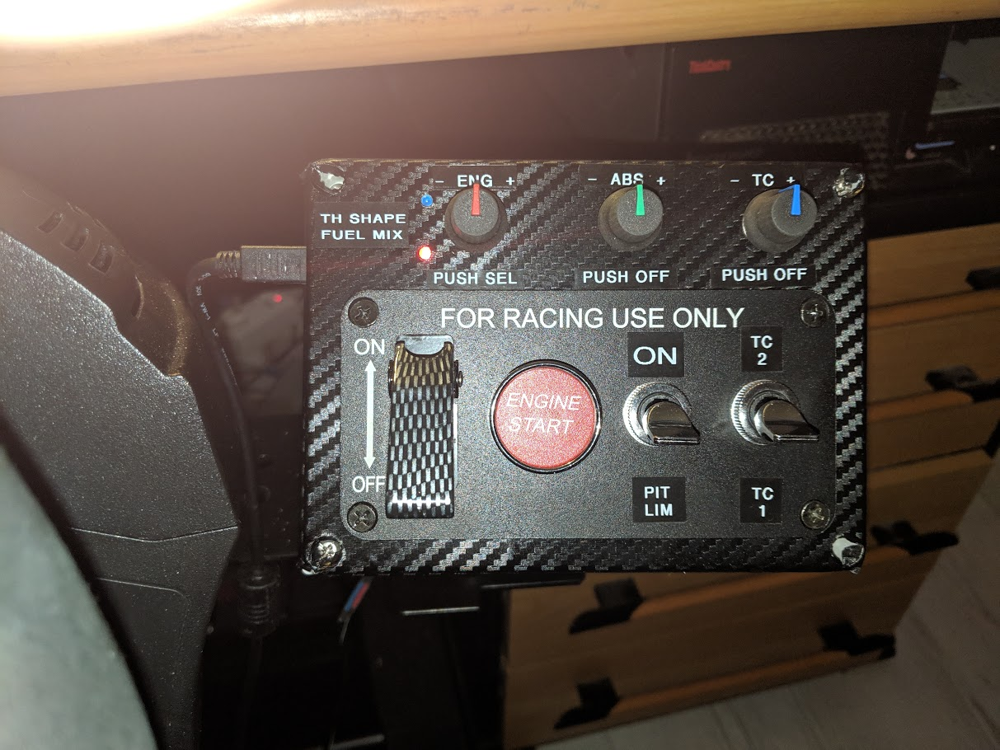
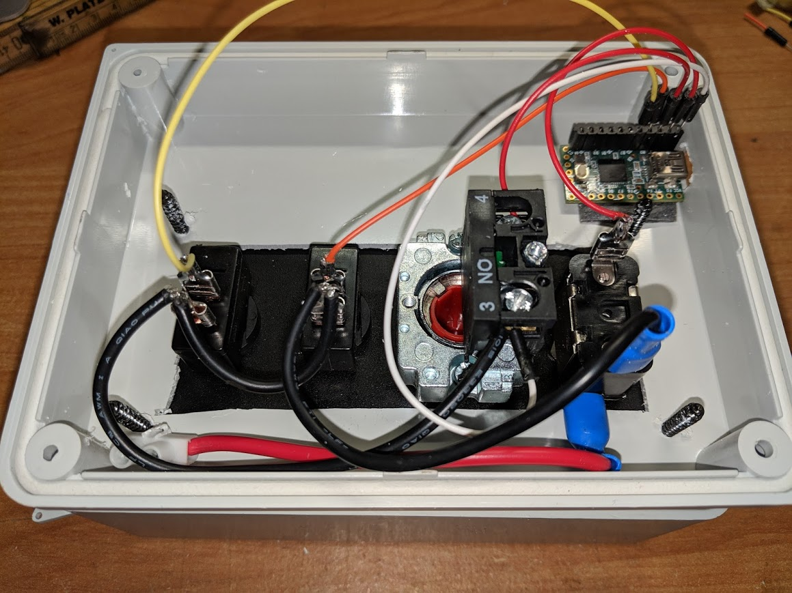
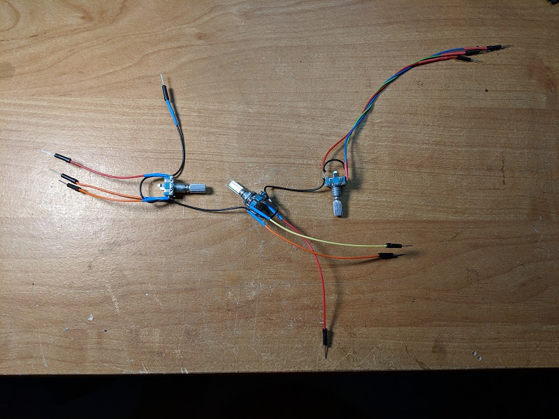

# Buttonbox for engine start and control

## Motivation

The idea came to me when I saw [this Panel on Amazon](https://www.amazon.de/dp/B01BV9CWW2/?coliid=ILLJIW41VWR2C&colid=2JV752ZE9GTFC&psc=0&ref_=lv_ov_lig_dp_it).

Then I saw similar panel on [aliexpress.com](https://de.aliexpress.com/item/12V-20A-Carbon-Faser-Sim-Racing-Auto-Z-ndung-Schalter-Ersatz-Panel-Push-Start-anzeige-licht/32913185496.html) and ordered it.

## Parts

<table>
    <tr>
        <th>Part</th><th>Link</th><th>Price</th>
    </tr>
    <tr>
		<td>Starter Panel</td>
 		<td>https://de.aliexpress.com/item/12V-20A-Carbon-Faser-Sim-Racing-Auto-Z-ndung-Schalter-Ersatz-Panel-Push-Start-anzeige-licht/32913185496.html</td>
		<td>15 &euro;</td>
    </tr>
    <tr>
        <td>Teensy 2.0</td>
        <td>https://de.aliexpress.com/item/Winzig-2-0-Winzig-USB-Entwicklung-Bord/32857413855.html</td>
        <td>7 &euro;</td>
    </tr>
    <tr>
        <td>Plastic box 150x115x75 mm</td>
        <td>Where you can find it</td>
        <td>&lt; 10 &euro;</td>
    </tr>
    <tr><td colspan="3"><strong>Optional it you want the light in the safety switch</strong></td></tr>
    <tr>
        <td>12DC power supply</td>
        <td>https://de.aliexpress.com/item/Hohe-Qualit-t-Hat-Netzteil-DC-12-V-1A-2A-3A-5A-6A-7A-8A-10A/32990654263.html</td>
        <td>2 &euro;</td>
    </tr>
    <tr>
        <td>12 DC Relay</td>
		<td>https://de.aliexpress.com/item/Freies-Verschiffen-10-teile-los-HK4100f-DC12V-SHG-Relais-hk4100F-DC12V-HK4100F-12-V-DIP6-3A/32861475552.html</td>
        <td>3 &euro;</td>
    </tr>
    <tr>
    	<td colspan="3"><strong>Encoder option</strong></td>
    </tr>
    <tr>
    	<td>Rotary encoders</td>
		<td>https://www.aliexpress.com/item/5PCS-Plum-handle-20mm-rotary-encoder-coding-switch-EC11-digital-potentiometer-with-switch-5-Pin/32872023811.html?spm=a2g0s.9042311.0.0.2f9f4c4d1MRzG0</td>
		<td>2 &euro;</td>
    </tr>
    <tr>
    	<td>Encoder caps, 3 colors</td>
		<td>https://www.aliexpress.com/store/product/10PCS-lot-Blue-Volume-Control-Rotary-Knobs-For-6mm-Dia-Knurled-Shaft-Potentiometer-Durable/1943479_32923555121.html?spm=2114.12010612.8148356.23.614365aeMxW6G2</td>
    	<td>3 &euro;</td>
    </tr>
    <tr>
    	<td>3mm LED</td>
    	<td>https://www.aliexpress.com/item/5Colors-20PCS-100PCS-1Color-100pcs-F3-3mm-LED-Diode-Light-Assorted-Kit-Green-Blue-White-Yellow/32886530132.html?spm=a2g0s.9042311.0.0.2f9f4c4dl8VwdI</td>
    	<td>1 &euro;</td>
    </tr>
</table>

Some additional material like wires, pin headers and adhesive pads. All together should you cost not more than 45 €.
The box should be at least 50mm in depth.

## Software requirements

You will need a programming environment for the Teensy microcontroller. I recommend [Teensyduino](https://www.pjrc.com/teensy/teensyduino.html).
Simply follow the [Download+Install](https://www.pjrc.com/teensy/td_download.html) guide on prjc.com

The provided Arduino sketches are usable for iRacing. 

There are two variants: One using keyboard mappings and another emulating joystick buttons. 

Each variant can be configured by changing the KEY\_??? oder JOY\_BTN\_??? defines in the config.h file. Changes in pin assignments may also
be made in config.h.

So you should be able to easily adopt it to any other racing simulation and/or racing equipment.

## Building

* Pre-wire the starter panel/relay accoring to the wiring diagram.
* Encoder option: Prepare encoder wiring according to the wiring diagram.
* Make the neccessary cutout in the box and mount the panel using the screws delivered with it. Tip: Fix the ACC switches with some hot glue - the plastic gland is really weak and easliy overturned.
* Make a cutout for the mini USB plug and the optional power supply wire.
* Encoder option: Drill 7mm holes for encoders and LED.
* Solder wires or pin headers on the Teensy.
* Mount the Teensy and optonal relay using adhesive pads.
* Encoder option: Mount encoders and LED in the drilled holes. Fix LED with some hot glue.
* Attach the prepared wirings to the Teensy.
* Load the provided Teensyduino sketch into the Teensy.
* Connect the Teensy and optional power supply.
* Test and Happy Racing.

### Wiring diagram

### Wiring WITHOUT optional relay

### Prewired encoders

## Mounting

I used a bent drywall connector as box mount. But any metal ankle will do the same. I used the shifter mount of my drive stand as mount base.

